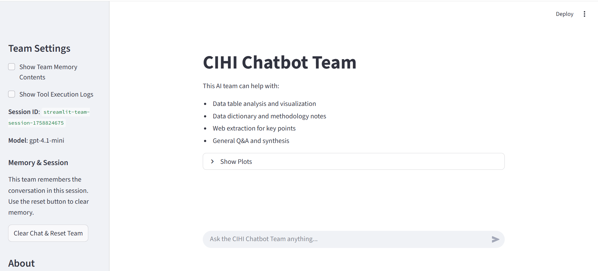
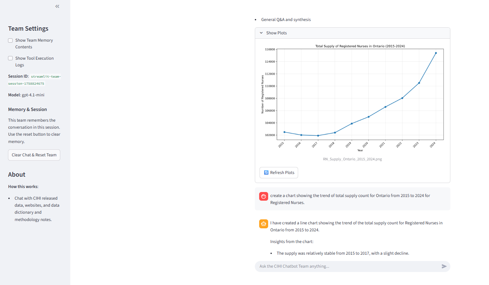

# CIHI Chatbot 🤖📊

A collaborative multi-agent AI system for analyzing Canadian Institute for Health Information (CIHI) datasets, extracting knowledge from official documents, and generating interactive visualizations. This project integrates **Streamlit**, **Agno multi-agent framework**, and **OpenAI LLMs** to provide an intelligent assistant capable of data analysis, knowledge retrieval, and web extraction.

---

## 🚀 Features

- **Multi-Agent Team Architecture**  
  - Specialized agents for data tables, documentation, methodology notes, visualization, and web extraction.  
  - Coordinator agent delegates tasks to appropriate specialists.  

- **Knowledge-Driven**  
  - Uses **ChromaDB** and **SQLite** for vector + structured knowledge storage.  
  - Embedding support via OpenAI’s `text-embedding-3-small`.  

- **Interactive Visualizations**  
  - Automatic creation of charts, graphs, and plots using Streamlit.  
  - Supports PNG, JPEG, SVG, and PDF visualization outputs.  

- **Web Crawling & Summarization**  
  - Extracts and summarizes key points directly from CIHI websites.  

- **Memory & Context Awareness**  
  - Session memory ensures continuity across user queries.  
  - Agents can recall prior queries and avoid redundant work.  

- **Data Preprocessing & Cleaning**  
  - Automatic CSV cleaning (handling encodings, removing empty columns, normalizing filenames).  

---

## 📂 Project Structure

```
agents/
  cihi_web_agent.py           # Web extraction agent
  create_team.py              # Initializes and manages the multi-agent team
  doc_agent.py                # Data dictionary & methodology notes agents
  general_agent.py            # General assistant agent
  nursing_datatable_agent.py  # Handles CSV cleaning and analysis
  visualization_workflow.py   # Orchestrates data visualization workflow
.python-version               # Python version spec (3.13)
config.py                     # Central configuration class
main.py                       # Streamlit entrypoint app
pyproject.toml                # Dependencies and project metadata
upload_docs.py                # Uploads & embeds PDF documents into knowledge bases
```

---

## 🛠️ Installation

### 1. Clone the repository

```bash
git clone https://github.com/your-username/cihi-chatbot.git
cd cihi-chatbot
```

### 2. Create a virtual environment

```bash
python3.13 -m venv venv
source venv/bin/activate   # On Linux/Mac
venv\Scripts\activate    # On Windows
```

### 3. Install dependencies

```bash
pip install -e .
```

Or directly via `pyproject.toml`:

```bash
pip install poetry
poetry install
```

### 4. Set environment variables

Create a `.env` file in the project root:

```
OPENAI_API_KEY=your_openai_api_key
MODEL_NAME=gpt-4o-mini   # or another supported OpenAI model
```

---

## ▶️ Usage

### Start the Streamlit app:

```bash
streamlit run main.py
```

This launches the **CIHI Chatbot Team** web interface.  

You can:
- Upload and query CIHI data tables (`.csv` files).  
- Extract knowledge from **Data Dictionary** and **Methodology Notes PDFs**.  
- Ask for **visualizations** (appearing in the "Show Plots" section).  
- Get **summarized insights** from CIHI websites.  

---

## 📊 Example Queries

- “Show me the number of Registered Nurses by province.”  
- “What are the methodology notes for Manitoba workforce data in 2024?”  
- “Generate a bar chart of nurse practitioners by age group.”  
- “Summarize the key points from CIHI’s Licensed Practical Nurses page.”  

---

## 🔧 Development

- Built with **Agno Framework** for agent orchestration.  
- Supports **knowledge embedding** with OpenAI + ChromaDB.  
- Uses **Streamlit** for an interactive frontend.  
- Easily extendable with new agents (e.g., for new datasets or visualization types).  

To add a new dataset:
1. Place the `.csv` file inside the `data/` folder.  
2. Run the app – the system automatically cleans and integrates it.  

To add new knowledge documents:
1. Place the `.pdf` file in the `data/` folder.  
2. Update the `files` list in `upload_docs.py`.  
3. Run `python upload_docs.py` to embed it into the knowledge base.  

---

## 📷 Screenshots

### Home Interface


### Visualization Example


---

## ⚖️ License

This project is licensed under the MIT License – see the [LICENSE](LICENSE) file for details.

---

## 🙌 Acknowledgments

- Canadian Institute for Health Information (CIHI) for datasets and documentation.  
- [Agno](https://pypi.org/project/agno/) multi-agent framework.  
- [Streamlit](https://streamlit.io/) for interactive dashboards.  
- [ChromaDB](https://www.trychroma.com/) for vector-based knowledge retrieval.  
- [OpenAI](https://platform.openai.com/) for LLM integration.  
